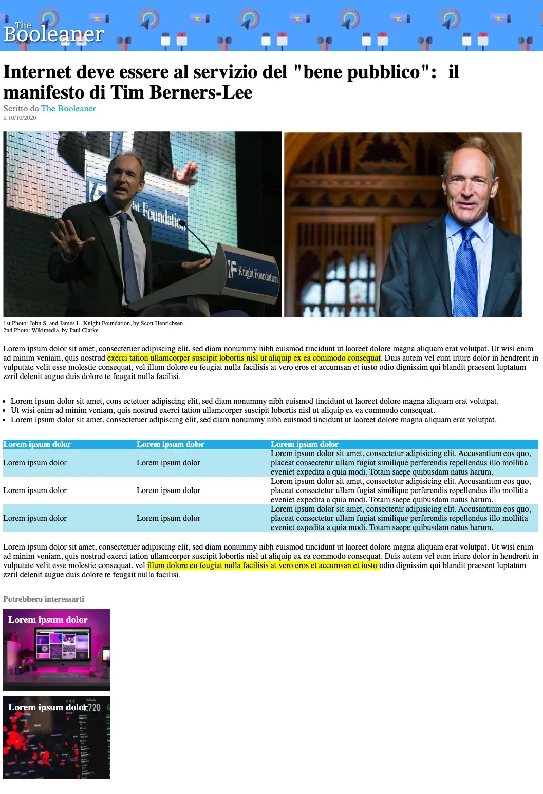

Terzo Esercizio Classe #137 - Boolean
===
Studente: Fabio Ferrero

---
# English

## Target of the project:
Replicate a web page using HTML and CSS basics, starting from a screenshot

- <strong>Bonus Content:</strong> Comment Line 6 \ Uncomment Line 7 of index.html file to see "boxed" layout of the web page

---
# Italiano

## Obiettivo del progetto:
Replicare una pagina web con l'utilizzo delle basi di HTML e CSS, partendo da uno screenshot

- <strong>Contenuto Bonus:</strong> Commenta la linea 6 \ decommenta la linea 7 del file index.html per vedere il layout "boxed" della pagina web

---

---

---
<strong>Lo screenshot della pagina fornita dal coach è il seguente:</strong>

